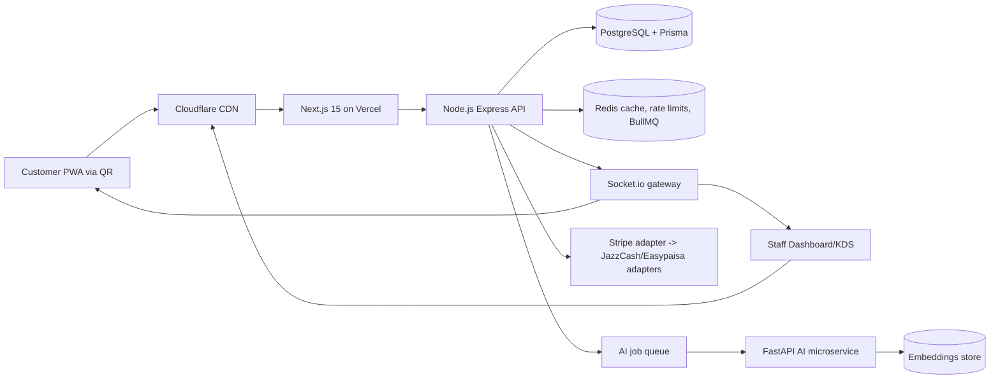

# Scan-to-Order SaaS Architecture

## 1. System architecture

The platform is a multi-tenant, event-driven SaaS composed of a Next.js customer/staff web app, an Express API, PostgreSQL for durable state, Redis for cache/queues/realtime fanout, and an optional FastAPI AI worker for forecasting and recommendations.



### Runtime boundaries

- **Web app:** customer ordering, staff dashboard, cashier, kitchen display, SaaS owner console, PWA shell.
- **API app:** tenant-aware REST endpoints, auth verification, RBAC, order state machine, payment orchestration, audit logs.
- **AI service:** queue-based FastAPI worker that owns prompts, embeddings, demand forecasts, menu copy generation, chatbot tools, and analytics summaries.
- **Data plane:** PostgreSQL for canonical data, Redis for menu cache, idempotency keys, Socket.io adapter, BullMQ jobs, and rate limits.

## 2. Folder structure

```text
apps/
  web/                 # Next.js 15 frontend deployed to Vercel
    src/app/           # App Router routes for customer and dashboard experiences
    src/components/    # Reusable shadcn-style UI, customer, dashboard, layout components
    src/lib/           # API client, i18n, formatting, constants
    public/            # PWA manifest, service worker, icons
  api/                 # Express API deployed to Railway/Render
    src/config/        # env, database, redis, logger
    src/modules/       # feature modules: tenancy, menu, orders, realtime, AI, payments
    src/shared/        # middleware, types, reusable utilities
    prisma/            # PostgreSQL schema and migrations
packages/
  shared/              # Cross-app TypeScript contracts and Zod DTOs
.github/workflows/     # CI pipeline
```

Architecture rules:

- Use feature-based modules.
- Keep business logic in services, not controllers.
- Use repositories for database access.
- Validate external input with Zod DTOs.
- Use Next.js server actions only for trusted server-side mutations that still call API services.
- Publish integration events for order, payment, menu, and inventory changes.

## 3. Database schema

The Prisma schema models SaaS tenancy, branch operations, customer ordering, payment abstraction, auditability, and analytics readiness.

Core entities:

- **Tenant:** restaurant/business account with subscription plan and settings.
- **Branch:** physical outlet with timezone, currency, and address.
- **User + Membership:** users can belong to multiple tenants/branches with scoped roles.
- **Table:** QR-addressable table/counter identifier.
- **MenuCategory, MenuItem, ModifierGroup, ModifierOption:** normalized customizable menu.
- **InventoryItem:** stock tracking and reorder thresholds.
- **Order, OrderItem, OrderItemModifier:** immutable order lines with status transitions.
- **Payment:** provider-agnostic payment records for Stripe, JazzCash, Easypaisa, and cash.
- **Coupon, LoyaltyAccount, Feedback, AuditLog, EventOutbox:** growth, retention, and event-driven operations.

## 4. API routes

All tenant-scoped routes resolve tenant from authenticated membership, `x-tenant-id`, or QR slug context. Mutations require idempotency keys for retry-safe mobile flows.

| Method | Route | Purpose |
| --- | --- | --- |
| GET | `/health` | service health |
| GET | `/v1/public/:tenantSlug/:tableCode/menu` | QR menu bootstrap |
| POST | `/v1/public/:tenantSlug/:tableCode/orders` | customer order placement |
| GET | `/v1/public/orders/:orderCode` | live order lookup |
| GET | `/v1/tenants/:tenantId/dashboard/summary` | KPI summary |
| CRUD | `/v1/tenants/:tenantId/menu/items` | menu management |
| CRUD | `/v1/tenants/:tenantId/inventory/items` | inventory management |
| CRUD | `/v1/tenants/:tenantId/tables` | QR/table management |
| PATCH | `/v1/tenants/:tenantId/orders/:orderId/status` | staff order workflow |
| POST | `/v1/tenants/:tenantId/payments/intents` | payment intent abstraction |
| POST | `/v1/tenants/:tenantId/ai/menu-description` | AI menu copy |
| POST | `/v1/tenants/:tenantId/ai/forecast` | AI demand forecast |
| GET | `/v1/tenants/:tenantId/audit-logs` | compliance trail |

## 5. Authentication flow

1. Customer scans QR and receives a signed table context token from the public menu endpoint.
2. Anonymous customers can order with table token + idempotency key; phone/email is optional for receipts and loyalty.
3. Staff/admins authenticate with Clerk/Auth.js.
4. API verifies the identity token, loads memberships, and computes effective permissions.
5. RBAC middleware checks tenant, branch, role, and action before controllers run.
6. Sensitive mutations create audit logs and outbox events.

Roles:

- `CUSTOMER_SESSION`: QR-scoped ordering only.
- `WAITER`: create/update dine-in orders and table state.
- `KITCHEN`: read orders and move food preparation statuses.
- `CASHIER`: payments, refunds, receipts.
- `MANAGER`: menu, inventory, coupons, staff, analytics.
- `OWNER`: billing, branches, subscription, integrations.
- `SAAS_ADMIN`: cross-tenant operations.

## 6. Multi-tenant design

- Every operational table stores `tenantId`; branch-level resources also store `branchId`.
- Tenant context is resolved before handlers and passed explicitly to services/repositories.
- Prisma queries always include tenant filters through repository methods.
- Redis keys use `tenant:{tenantId}:...` prefixes.
- Socket.io rooms use `tenant:{tenantId}:branch:{branchId}:orders` and `order:{orderId}`.
- Future enterprise isolation can move high-volume tenants to dedicated databases while preserving the same repository contracts.

## 7. Realtime order flow

1. Customer opens QR URL `/r/:tenantSlug/:tableCode`.
2. Web app fetches cached menu and table context.
3. Customer customizes cart and submits order optimistically.
4. API validates table, menu prices, modifiers, inventory, coupon, and idempotency key.
5. API creates order in a transaction, writes audit log, decrements reserved inventory, and inserts `ORDER_CREATED` outbox event.
6. Socket gateway emits `order.created` to kitchen/cashier rooms and `order.updated` to the customer order room.
7. Kitchen updates status: `PLACED -> ACCEPTED -> PREPARING -> READY -> SERVED`.
8. Status events update customer tracking UI instantly and are persisted for analytics.

## 8. Deployment architecture

- **Frontend:** Vercel with edge caching, image optimization, environment-specific API URL, and preview deployments.
- **Backend:** Railway/Render Docker service with horizontal replicas.
- **Database:** Managed PostgreSQL with daily backups, PITR, connection pooling, and read replicas for analytics.
- **Redis:** Upstash/Redis Cloud for cache, queues, rate limits, and Socket.io pub/sub adapter.
- **CDN/WAF:** Cloudflare for DNS, TLS, cache rules, bot protection, and Pakistan-friendly edge performance.
- **Observability:** structured logs, request IDs, OpenTelemetry traces, error tracking, uptime checks, and business metric dashboards.

## 9. PWA architecture

- Installable manifest with standalone display mode.
- Service worker caches shell assets, QR landing route, fonts, and last successful menu response.
- Network-first strategy for orders and payments; stale-while-revalidate for menu/categories.
- Offline cart persistence in IndexedDB/localStorage with replay once connectivity returns.
- Push notifications for order status, promotions, and staff alerts.
- Mobile-first UI optimized for low-end Android phones with under-2s first load target and Lighthouse > 90.

## 10. Recommended development roadmap

### Phase 1 — MVP ordering foundation

- Monorepo setup, CI, env validation.
- Tenant/branch/table/menu/order/payment schemas.
- Customer QR menu, cart, order placement, KDS dashboard.
- Socket.io realtime order tracking.

### Phase 2 — Restaurant operations

- Menu CRUD, modifiers, inventory, coupons.
- Staff roles, audit logs, table QR generator.
- Cashier workflow and payment abstraction.
- PWA offline cart and push notifications.

### Phase 3 — SaaS monetization

- Subscription billing, usage limits, onboarding, branch/franchise support.
- Analytics dashboards, exports, peak-hour reporting.
- Referral and loyalty system.

### Phase 4 — AI differentiation

- FastAPI AI worker with queue processing.
- Demand forecasting, smart upsells, menu recommendations.
- AI chatbot and analytics summaries.
- Embedding-backed customer/menu personalization.

### Phase 5 — Production hardening

- Load testing, rate limiting, caching audits.
- Observability, incident runbooks, backup restore drills.
- Security reviews, OWASP hardening, accessibility pass.
